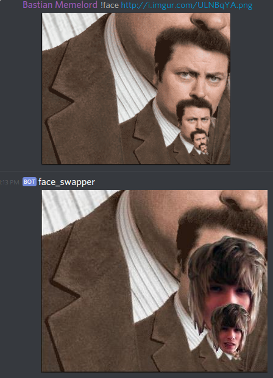
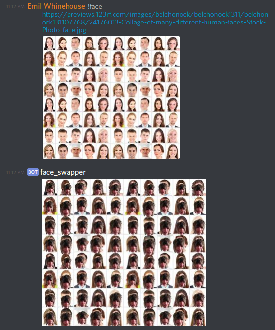

# Discord face swapping bot

Why? Joy.

## Instructions

0. Add you discord bot to your guild
1. Set env. variable DISCORD_TOKEN="your bot token"
2. Call via `!face <url>` or `!face <image attachment>`

## Examples

## License

MIT
