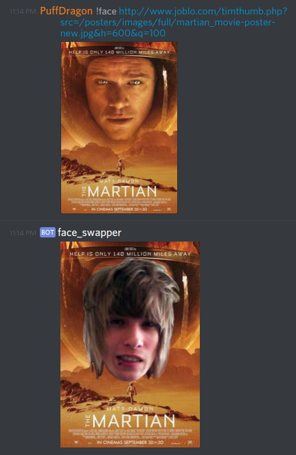

# Discord face swapping bot

Why? Joy.

## Instructions

0. Add you discord bot to your guild
1. Set env. variable DISCORD_TOKEN="your bot token"

## Commands

### !face _args_
Providing no options will replace faces on image.

#### `print`
Prints current replacement image.

#### `load` _url_
Replaces the replacement image with the provided image. 

_Hint:_ It's a good idea to use PNG files with a transparent background.

## Examples

## License

MIT
